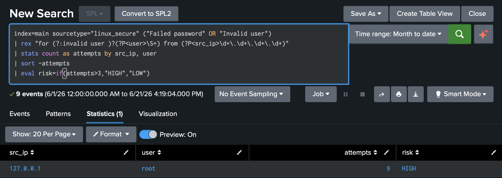
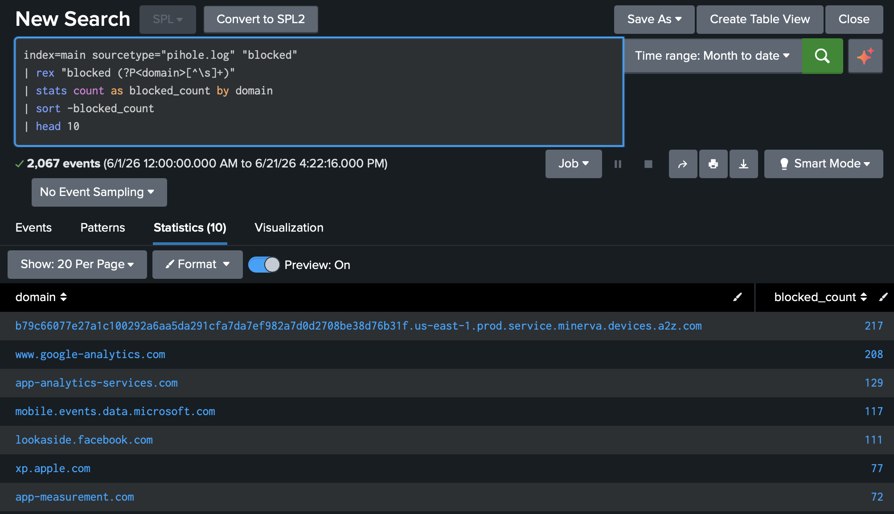

# SOC Home Lab – Splunk SIEM

## Środowisko
Splunk Free w Dockerze na dedykowanym serwerze Ubuntu 26.04 (Lenovo YOGA, 8 GB RAM).

## Co zrobiłem

Zaindeksowałem dwa źródła logów: auth.log z systemu Linux i logi DNS z Pi-hole.

Na auth.log napisałem zapytanie SPL wykrywające nieudane logowania SSH. Grupuję próby po IP źródłowym i użytkowniku, klasyfikuję ryzyko jako HIGH jeśli z jednego IP przyszło więcej niż 3 próby. Skonfigurowałem alert który odpala się automatycznie gdy IP przekroczy próg 5 prób.

Na logach Pi-hole analizuję ruch DNS w sieci. Wyciągam zablokowane domeny, sortuję po liczbie prób połączenia. W trakcie analizy wykryłem urządzenie w sieci regularnie odpytujące domenę figurującą na blocklist Pi-hole – prześledziłem źródło do konkretnego IP.

## Zapytanie SPL – detekcja brute-force SSH
```splunk
index=main sourcetype="linux_secure" ("Failed password" OR "Invalid user")
| rex "for (?:invalid user )?(?P<user>\S+) from (?P<src_ip>\d+\.\d+\.\d+\.\d+)"
| stats count as attempts by src_ip, user
| sort -attempts
| eval risk=if(attempts>3,"HIGH","LOW")
```
## Zapytanie SPL – analiza DNS Pi-hole
```splunk
index=main sourcetype="pihole.log" "blocked"
| rex "blocked (?P<domain>[^\s]+)"
| stats count as blocked_count by domain
| sort -blocked_count
| head 10
```

## Technologie
Splunk, SPL, Docker, Linux, SSH, Pi-hole, auth.log, DNS logs

```markdown
## Screenshots


